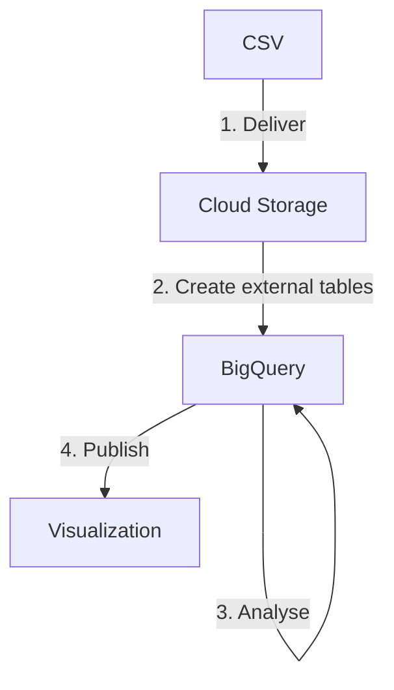
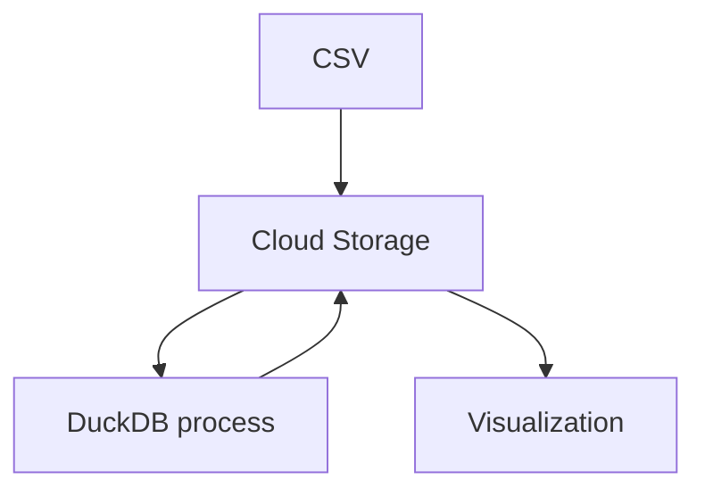
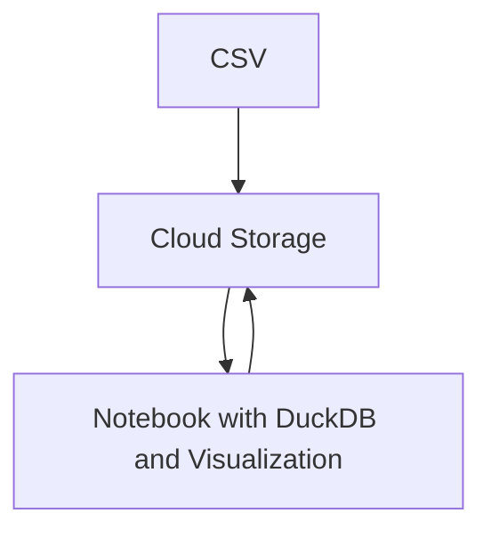

+++
title = 'Simplify analytic pipeline with DuckDB'
author = 'Kha Nguyen'
date = 2023-11-02T23:27:12+02:00
draft = true
tags = ['duckdb', 'analytics', 'sql']
+++

DuckDB is a cost-effective and portable analytics database.

## Introduction

BigQuery is a powerful cloud-based analytics platform, but it can be expensive, and it ties you to the Google Cloud Platform. DuckDB is a fast, lightweight, and portable analytics database that can be used as a cost-effective alternative to BigQuery.

DuckDB is a columnar database, which means that it stores data in columns instead of rows. This makes it very efficient for running analytical queries. DuckDB is also highly portable, and it can be run on a variety of platforms, including laptops, servers, and even in the cloud.

## Use cases for DuckDB

DuckDB can be used for a wide variety of analytics tasks, including:

- Exploratory data analysis (EDA)
- Data wrangling and cleaning
- Machine learning model development and evaluation
- Business intelligence and reporting

## Benefits of using DuckDB

There are several benefits to using DuckDB, including:

- Cost-effective: DuckDB is open source and free to use. It is also very efficient, so you can run your analytics queries on a less expensive machine.
- Portable: DuckDB can be run on a variety of platforms, including laptops, servers, and even in the cloud. This gives you flexibility to choose the platform that best suits your needs.
- Fast: DuckDB is very fast at running analytical queries. It is often much faster than traditional row-based databases.
- Easy to use: DuckDB uses SQL, so it is easy to learn and use for anyone who is already familiar with SQL.

## How to use DuckDB together with Jupyter Notebook and Papermill

Jupyter Notebook is a popular open source tool for interactive data analysis. Papermill is a tool that allows you to schedule and automate Jupyter Notebooks.

To use DuckDB together with Jupyter Notebook and Papermill, you can follow these steps:

1. Install DuckDB.
1. Create a Jupyter Notebook.
1. Import the DuckDB Python library.
1. Connect to your DuckDB database.
1. Write your SQL queries and run them in the Jupyter Notebook.
1. Use Papermill to schedule and automate your Jupyter Notebook.

## Alternatives to BigQuery

In addition to DuckDB, there are a number of other cost-effective analytics database solutions available, including:

- Amazon Redshift
- Snowflake
- Google Cloud Dataproc
- Apache Spark SQL
- Presto

## Conclusion

DuckDB is a powerful and versatile analytics database that can be used as a cost-effective alternative to BigQuery. It is also very portable and easy to use. If you are looking for a way to reduce your analytics costs and gain more flexibility, DuckDB is a great option to consider.

## Diagrams


